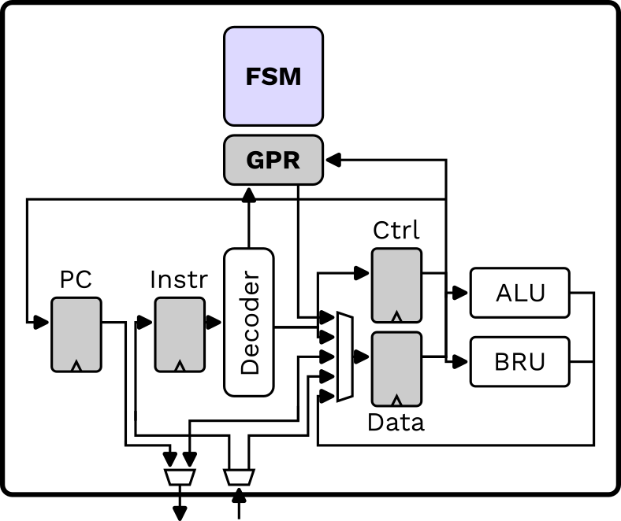

# Core Architecture to Learn Fundamentals (CALF)



- [RISC-V Design](#risc-v-design)
  - [VHDL](#vhdl)
    - [Tools](#tools)
    - [Simulation](#simulation)
    - [FPGA](#fpga)
    - [Convert](#convert)
  - [Chisel](#chisel)
    - [Tools](#tools-1)
    - [Simulation](#simulation-1)
    - [FPGA](#fpga-1)
  
## VHDL

### Tools 

- [GHDL](http://ghdl.free.fr/)
- [VUnit](https://vunit.github.io/)
- [GtkWave](https://gtkwave.sourceforge.net/)
- [Vivado]()

### Simulation

```bash 
  make vhd-sim
```

### FPGA

```bash 
  make vhd-fpga
```

### Convert

```bash
ghdl -a --std=08 -fsynopsys --work=emmk --workdir=work ../../src/main/vhd/consts.vhd ../../src/main/vhd/riscv.vhd ../../src/main/vhd/gpr.vhd 
ghdl --synth --std=08 -fsynopsys --work=emmk --workdir=work --out=verilog Gpr
```

## Chisel

### Tools 

- [verilator]()
- [sbt]()
- [GtkWave](https://gtkwave.sourceforge.net/)
- [Vivado]()

### Simulation

```bash 
  make chisel-sim
  ./obj/VSim --ram sw/hex/sw.ram.mem --boot .tmp/bootloader.hex --ntrigger 50000 --vcd test.vcd
```

### FPGA

```bash 
  make chisel-fpga
```

